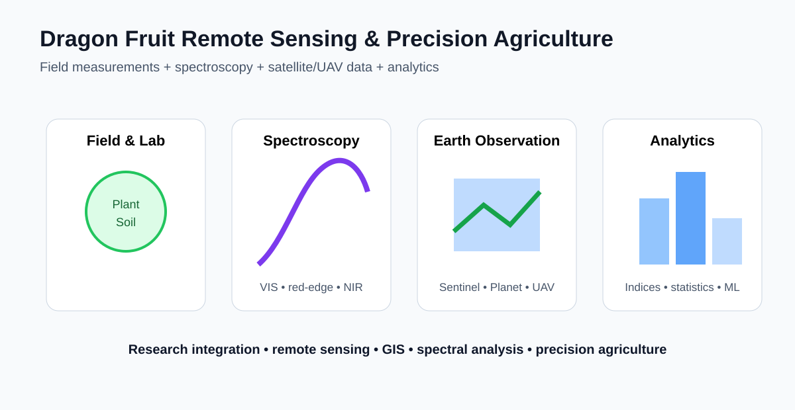
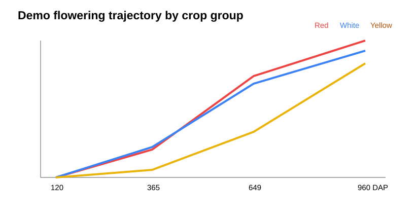
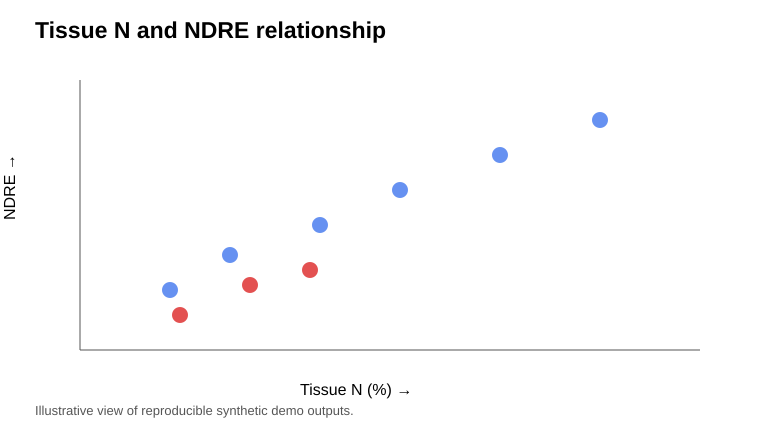
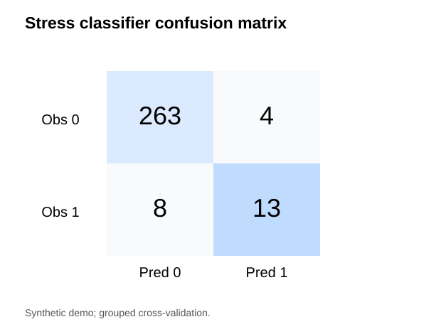
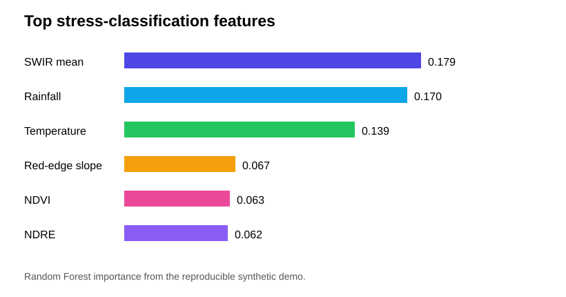
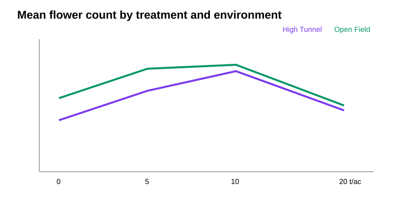
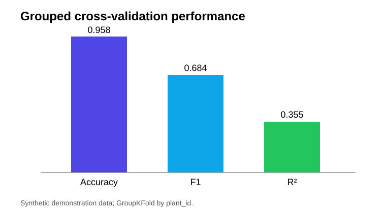
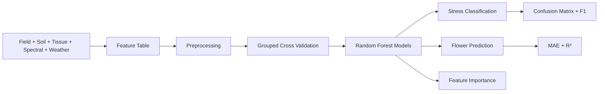

# Dragon Fruit Remote Sensing & Precision Agriculture



[](https://www.python.org/)
[](https://scikit-learn.org/)
[](#)
[](#)
[](LICENSE)

A recruiter-ready, reproducible agricultural data-science portfolio connecting **field experiments, plant and soil measurements, hyperspectral/vegetation indicators, satellite workflows, statistics, and machine learning** for precision-agriculture decision support.

> **Data transparency:** the public CSV in this repository is **synthetic demonstration data generated by code**. It mirrors the structure of a multi-factor South Florida dragon-fruit experiment but does **not** contain unpublished doctoral measurements. All committed model metrics and charts below are reproducible outputs from that synthetic dataset.

---

## Recruiter summary

This repository demonstrates an end-to-end workflow rather than a README-only concept:

**Experimental design → data generation/ingestion → QA/QC-ready table → nutrient & spectral analysis → grouped ML validation → explainable outputs → figures & decision-support artifacts**

### What this project demonstrates

- Agricultural experimental-data structure: **3 crop groups × 4 amendment rates × 2 environments × 3 replicates = 72 plants**
- Longitudinal observations at **120, 365, 649, and 960 days after planting**
- Integration of field growth, flowering/fruit counts, soil nutrients, plant-tissue nutrients, spectral indicators, and weather variables
- Python data engineering and reproducible analysis
- Random Forest classification and regression
- **GroupKFold validation by plant ID** to reduce repeated-measure leakage
- Feature-importance reporting and confusion-matrix evaluation
- Google Earth Engine Sentinel-2 workflow with NDVI, NDRE, GNDVI, and NDMI
- Unit-tested vegetation-index utilities
- Transparent separation of public demonstration data from measured research data

---

## Visual results

| Crop phenology | Nutrient + spectral relationship |
|---|---|
|  |  |

| Model evaluation | Feature importance |
|---|---|
|  |  |

| Treatment response | Model performance |
|---|---|
|  |  |

---

## Demonstration model results

The committed results are generated by `python scripts/run_demo.py`.

| Task | Model | Validation | Metric |
|---|---|---|---|
| Crop-stress screening | Random Forest Classifier | GroupKFold by `plant_id` | Accuracy **0.958**, F1 **0.684** |
| Flower-count prediction | Random Forest Regressor | GroupKFold by `plant_id` | MAE **0.659**, R² **0.355** |

The flower-count model intentionally reports a modest R² rather than hiding a difficult sparse-count prediction task. These values are **demo metrics only**, not biological findings.

See [`results/model_metrics.csv`](results/model_metrics.csv) for the machine-readable results.

---

## Why grouped validation matters

Each synthetic plant appears at multiple observation dates. A random row-level train/test split could place records from the same plant in both training and testing, producing an overly optimistic estimate.

This project therefore uses:

```text
plant_id
   ↓
GroupKFold
   ↓
No plant appears in both train and validation fold
   ↓
More defensible repeated-measure evaluation
```

That validation choice is implemented in [`src/machine_learning.py`](src/machine_learning.py).

---

## Project architecture

```text
dragon-fruit-remote-sensing-precision-agriculture/
│
├── README.md
├── requirements.txt
├── LICENSE
├── CITATION.cff
│
├── data/
│   ├── README.md
│   └── sample_dragon_fruit_demo.csv
│
├── notebooks/
│   ├── 01_data_exploration.ipynb
│   ├── 02_nutrient_and_spectral_analysis.ipynb
│   ├── 03_machine_learning.ipynb
│   └── 04_end_to_end_demo.ipynb
│
├── src/
│   ├── data_generation.py
│   ├── vegetation_indices.py
│   ├── spectral_analysis.py
│   ├── nutrient_analysis.py
│   ├── statistics.py
│   └── machine_learning.py
│
├── scripts/
│   └── run_demo.py
│
├── gee/
│   └── sentinel2_processing.js
│
├── figures/
│   ├── confusion_matrix.svg
│   ├── feature_importance.svg
│   ├── model_performance.svg
│   ├── nutrient_spectral_relationship.svg
│   ├── phenology_time_series.svg
│   └── treatment_response.svg
│
├── results/
│   ├── model_metrics.csv
│   ├── feature_importance.csv
│   ├── flower_predictions_grouped_cv.csv
│   ├── late_season_k_summary.csv
│   └── treatment_summary.csv
│
└── tests/
    └── test_indices.py
```

---

## Quick start

```bash
git clone https://github.com/belbasepriyanka/dragon-fruit-remote-sensing-precision-agriculture.git
cd dragon-fruit-remote-sensing-precision-agriculture

python -m venv .venv
# Windows:
.venv\Scripts\activate
# macOS/Linux:
# source .venv/bin/activate

pip install -r requirements.txt
python scripts/run_demo.py
```

Run the test:

```bash
python -m pytest -q
```

The demo script regenerates:

- `data/sample_dragon_fruit_demo.csv`
- model metrics and prediction tables in `results/`
- all analytical figures in `figures/`

---

## Notebook walkthrough

### [`01_data_exploration.ipynb`](notebooks/01_data_exploration.ipynb)
Loads the public demonstration dataset, checks the experimental structure, summarizes numerical fields, and compares crop-response variables across environment, crop group, and treatment.

### [`02_nutrient_and_spectral_analysis.ipynb`](notebooks/02_nutrient_and_spectral_analysis.ipynb)
Demonstrates PCA-ready spectral analysis and examines relationships between plant-tissue nutrient variables and spectral indicators such as NDRE.

### [`03_machine_learning.ipynb`](notebooks/03_machine_learning.ipynb)
Runs the grouped Random Forest stress classifier and flower-count regressor, reports metrics, confusion matrix, and feature importance.

### [`04_end_to_end_demo.ipynb`](notebooks/04_end_to_end_demo.ipynb)
Provides the shortest reproducible path through the repository and reruns the entire pipeline.

---

## Data and features

The generated table includes:

### Experimental context
- environment
- crop group/species
- amendment treatment
- replicate
- plant ID
- days after planting

### Field and crop response
- growth
- stem diameter
- flower count
- fruit count

### Soil and plant tissue
- soil N, P, K
- tissue N, P, K

### Remote-sensing / spectral indicators
- NDVI
- NDRE
- GNDVI
- red-edge slope
- mean NIR response
- mean SWIR response

### Environment
- temperature
- rainfall

The full data dictionary is in [`data/README.md`](data/README.md).

---

## Machine-learning workflow



### Stress model
The classifier predicts a **synthetic stress flag** from agronomic, nutrient, spectral, and environmental variables.

### Flowering model
The regression workflow predicts synthetic flower counts and provides an example of a more difficult agricultural outcome where sparse observations limit predictive performance.

---

## Sentinel-2 / Google Earth Engine

[`gee/sentinel2_processing.js`](gee/sentinel2_processing.js) provides a reusable Sentinel-2 Level-2A workflow that:

1. filters `COPERNICUS/S2_SR_HARMONIZED`
2. masks cloud shadow, cloud, cirrus, and snow/ice using the Scene Classification Layer
3. calculates **NDVI, NDRE, GNDVI, and NDMI**
4. displays field-scale median index layers
5. generates a vegetation-index time series

The AOI is intentionally a demonstration rectangle and should be replaced with an actual field boundary for operational use.

---

## Replacing the demo with measured data

The repository is structured so private/measured data can replace the generated CSV without rewriting the entire project.

Recommended approach:

1. keep private research data outside the public repository
2. create a cleaned analysis table using the schema documented in `data/README.md`
3. update feature names in `src/machine_learning.py` if necessary
4. run the same grouped-validation workflow
5. regenerate figures/results
6. document which outputs are measured-data analyses versus public demos

This keeps **research integrity, reproducibility, and data governance** separate from portfolio demonstration code.

---

## Scientific and operational applications

The architecture is transferable to crop-specific datasets for:

- crop-health monitoring
- nutrient-status analysis
- plant-stress screening
- flowering/yield-related forecasting
- field-trial analytics
- remote-sensing time-series monitoring
- scouting prioritization
- precision-agriculture decision support

Transfer to another crop requires **crop-specific ground truth, calibration, and independent validation**.

---

## Reproducibility checks

The project was validated with:

```text
python scripts/run_demo.py
python -m pytest -q
```

The four notebooks were also executed end-to-end during repository preparation.

---

## Research context

This portfolio is motivated by doctoral research integrating field experiments, plant and soil measurements, hyperspectral reflectance, vegetation indices, GIS, statistical analysis, and remote-sensing methods for specialty-crop production in South Florida.

The public code is designed to demonstrate methods without presenting synthetic results as measured research findings.

---

## Author

**Priyanka Belbase**  
Agricultural Data Science • Remote Sensing • GeoAI • Machine Learning • Precision Agriculture

- [GitHub](https://github.com/belbasepriyanka)
- [Google Scholar](https://scholar.google.com/citations?user=bkSmlQ8AAAAJ&hl=en&oi=ao)
- [LinkedIn](https://www.linkedin.com/in/priyanka-belbase/)

---

## License and citation

Code is released under the [MIT License](LICENSE). Citation metadata is provided in [`CITATION.cff`](CITATION.cff).
